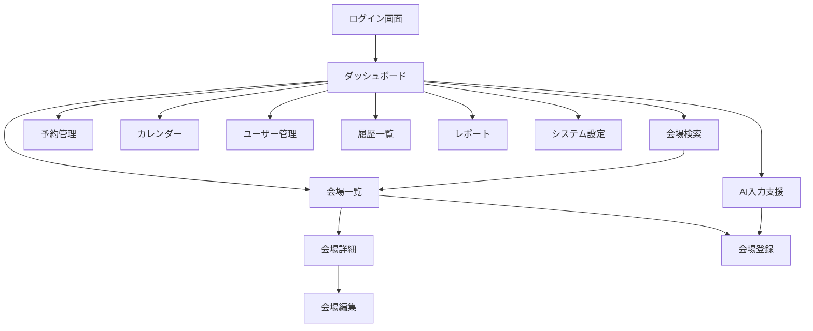

# 防災士研修センター会場管理システム 画面一覧

## 1. 画面体系図

```
ログイン画面
│
└── ダッシュボード
    ├── 会場管理
    │   ├── 会場一覧画面
    │   ├── 会場詳細画面
    │   ├── 会場登録画面
    │   ├── 会場編集画面
    │   └── 会場検索画面
    │
    ├── 予約管理
    │   ├── 予約管理画面
    │   └── カレンダー画面
    │
    ├── レポート
    │   ├── 利用統計レポート画面
    │   └── 会場比較レポート画面
    │
    ├── 管理機能
    │   ├── ユーザー管理画面
    │   ├── 権限設定画面
    │   ├── 履歴一覧画面
    │   └── システム設定画面
    │
    └── AI支援
        └── AI入力支援画面
```

## 2. 画面詳細

### 2.1 認証関連画面

#### SCR-001: ログイン画面
**画面概要**: システムへのログイン認証を行う画面

**画面要素**:
- ヘッダー
  - システムロゴ
  - システム名
- 入力エリア
  - メールアドレス入力欄
  - パスワード入力欄
  - 「パスワードを表示」チェックボックス
  - 「ログイン情報を記憶」チェックボックス
- ボタン
  - ログインボタン
  - パスワードリセットリンク
- フッター
  - コピーライト表示

**機能**:
- ログイン認証処理
- パスワードリセット画面への遷移
- 入力値バリデーション

---

#### SCR-002: パスワードリセット画面
**画面概要**: パスワードを忘れた場合のリセット画面

**画面要素**:
- メールアドレス入力欄
- 送信ボタン
- ログイン画面へ戻るリンク

**機能**:
- パスワードリセットメール送信

---

### 2.2 メイン画面

#### SCR-003: ダッシュボード画面
**画面概要**: ログイン後のメイン画面、各種サマリー情報を表示

**画面要素**:
- ヘッダー
  - システムロゴ
  - ユーザー名表示
  - ログアウトボタン
- サイドメニュー
  - 会場管理
  - 予約管理
  - レポート
  - 管理機能
  - AI支援
- メインコンテンツ
  - 登録会場数サマリー
  - 今月の予約状況
  - 最近の更新情報
  - お知らせ・通知
  - クイックアクセスボタン
    - 新規会場登録
    - 会場検索
    - 予約カレンダー

**機能**:
- 各種統計情報の表示
- 各画面への遷移
- 通知の表示

---

### 2.3 会場管理画面

#### SCR-004: 会場一覧画面
**画面概要**: 登録されている会場情報を一覧表示する画面

**画面要素**:
- 検索・フィルタエリア
  - フリーワード検索欄
  - 都道府県選択
  - 収容人数範囲
  - 検索ボタン
  - フィルタクリアボタン
- 一覧表示エリア
  - 表示件数選択（20/50/100件）
  - ソート選択（施設名/地域/収容人数/更新日）
  - 一覧テーブル
    - チェックボックス
    - NO
    - 進捗状況
    - 施設名
    - 住所
    - 収容人数
    - 概算料金
    - 更新日
    - アクション（詳細/編集/削除）
- ページネーション
- アクションボタン
  - 新規登録ボタン
  - 一括エクスポートボタン
  - 選択削除ボタン

**機能**:
- 会場情報の一覧表示
- ページング処理
- ソート処理
- 検索・フィルタリング
- 詳細画面への遷移
- 編集画面への遷移
- 削除処理
- CSV/Excelエクスポート

---

#### SCR-005: 会場詳細画面
**画面概要**: 選択した会場の詳細情報を表示する画面

**画面要素**:
- 基本情報タブ
  - 施設名
  - 進捗状況
  - 住所・地図
  - 電話番号
  - メールアドレス
  - 担当者
  - アクセス情報
- 施設情報タブ
  - 部屋情報
  - 収容能力
  - 設備情報
  - 利用条件
- 料金情報タブ
  - 各種料金詳細
  - 支払条件
- 予約情報タブ
  - 予約条件
  - キャンセル規定
  - 候補日
- 駐車場情報タブ
  - 施設内駐車場
  - 周辺駐車場
- 更新履歴タブ
  - 更新日時
  - 更新者
  - 更新内容
- アクションボタン
  - 編集ボタン
  - 削除ボタン
  - 印刷ボタン
  - 一覧へ戻るボタン

**機能**:
- 詳細情報の表示
- 編集画面への遷移
- 削除処理
- 印刷用レイアウト表示
- 地図表示（外部API連携）

---

#### SCR-006: 会場登録画面
**画面概要**: 新規会場情報を登録する画面

**画面要素**:
- 入力フォーム（ステップ形式）
  - ステップ1: 基本情報
    - 施設名*
    - 住所*
    - 電話番号*
    - メールアドレス
    - 担当者
    - アクセス情報
  - ステップ2: 施設詳細
    - 部屋名
    - 天井高
    - 広さ
    - 机の数
    - 椅子の数
    - 収容人数*
    - 飲食可否
    - 土足可否
    - 耐震基準
  - ステップ3: 設備情報
    - 各種設備チェックボックス
    - その他設備（自由記述）
  - ステップ4: 料金情報
    - 控室費用
    - メイン会場費用
    - 備品費用
    - 概算料金
  - ステップ5: 予約条件
    - 予約条件
    - キャンセル規定
    - 支払条件
  - ステップ6: 駐車場情報
    - 駐車台数
    - 駐車料金
    - 周辺駐車場情報
- AI入力支援ボタン
- 保存ボタン
- キャンセルボタン
- 一時保存ボタン

**機能**:
- 段階的な入力処理
- 入力値バリデーション
- 一時保存機能
- AI入力支援機能呼び出し
- 登録処理

---

#### SCR-007: 会場編集画面
**画面概要**: 既存会場情報を編集する画面

**画面要素**:
- 会場登録画面と同様の入力フォーム（既存データ表示）
- 変更箇所ハイライト表示
- 更新理由入力欄
- 更新ボタン
- キャンセルボタン
- 変更前後比較ボタン

**機能**:
- 既存データの表示
- 編集処理
- 変更差分の確認
- 更新履歴の記録

---

#### SCR-008: 会場検索画面
**画面概要**: 詳細な条件で会場を検索する画面

**画面要素**:
- 詳細検索フォーム
  - 基本条件
    - フリーワード
    - 都道府県
    - 市区町村
  - 収容条件
    - 収容人数（最小-最大）
    - 机の数（最小-最大）
    - 椅子の数（最小-最大）
  - 設備条件（チェックボックス）
    - 演台
    - ホワイトボード
    - スクリーン
    - ワイヤレスマイク
    - プロジェクター台
  - 料金条件
    - 概算料金（最小-最大）
  - その他条件
    - 飲食可
    - 土足可
    - 耐震基準適合
    - 控室あり
    - 駐車場あり
  - 利用可能日
    - カレンダー選択
- 検索ボタン
- 条件クリアボタン
- 検索条件保存ボタン
- 保存済み条件呼び出し

**機能**:
- 複合条件検索
- 検索条件の保存/呼び出し
- 検索結果の表示（一覧/地図）

---

### 2.4 予約管理画面

#### SCR-009: 予約管理画面
**画面概要**: 会場の予約状況を管理する画面

**画面要素**:
- フィルタエリア
  - 進捗状況選択
  - 期間選択
  - 地域選択
- 予約一覧
  - 施設名
  - 予約状況
  - 候補日
  - 担当者
  - メモ
  - アクション
- ステータス変更モーダル
  - ステータス選択
  - 変更理由
  - 通知送信チェック
- 一括操作ボタン

**機能**:
- 予約状況の一覧表示
- ステータス変更処理
- 通知送信機能
- 期限アラート表示

---

#### SCR-010: カレンダー画面
**画面概要**: 予約状況をカレンダー形式で表示する画面

**画面要素**:
- 表示切替タブ（月/週/日）
- カレンダー表示エリア
  - 日付セル
  - 予約情報表示
  - 色分け凡例
- サイドパネル
  - 会場フィルタ
  - ステータスフィルタ
  - 詳細情報表示
- ドラッグ&ドロップ対応

**機能**:
- カレンダー表示
- ドラッグ&ドロップでの予約変更
- 詳細情報のポップアップ表示
- 印刷用レイアウト

---

### 2.5 レポート画面

#### SCR-011: 利用統計レポート画面
**画面概要**: 会場利用の統計情報をレポート表示する画面

**画面要素**:
- 期間選択
- レポート種別選択
  - 月別利用実績
  - 地域別利用実績
  - 費用分析
- グラフ表示エリア
  - 棒グラフ
  - 円グラフ
  - 折れ線グラフ
- 詳細データテーブル
- エクスポートボタン（PDF/Excel）

**機能**:
- 統計データの集計
- グラフ描画
- レポート出力

---

#### SCR-012: 会場比較レポート画面
**画面概要**: 複数会場を比較するレポート画面

**画面要素**:
- 会場選択エリア（最大5件）
- 比較項目選択
- 比較表
- レーダーチャート
- エクスポートボタン

**機能**:
- 会場データの比較
- 視覚的な比較表示
- レポート出力

---

### 2.6 管理機能画面

#### SCR-013: ユーザー管理画面
**画面概要**: システムユーザーを管理する画面

**画面要素**:
- ユーザー一覧
  - ユーザーID
  - 氏名
  - メールアドレス
  - 権限
  - 最終ログイン
  - ステータス
  - アクション
- 新規ユーザー登録ボタン
- ユーザー登録モーダル
  - 基本情報入力
  - 権限設定
  - 通知設定
- 一括操作

**機能**:
- ユーザー一覧表示
- ユーザー登録/編集/削除
- 権限設定
- パスワードリセット

---

#### SCR-014: 権限設定画面
**画面概要**: ユーザーの権限を詳細設定する画面

**画面要素**:
- 権限グループ一覧
- 権限詳細設定
  - 機能別アクセス権
  - データ範囲設定
  - 承認権限
- カスタム権限作成

**機能**:
- 権限グループ管理
- 詳細権限設定
- 権限の複製/編集

---

#### SCR-015: 履歴一覧画面
**画面概要**: システムの更新履歴を表示する画面

**画面要素**:
- フィルタエリア
  - 期間選択
  - ユーザー選択
  - 操作種別選択
  - 対象選択
- 履歴一覧
  - 日時
  - ユーザー
  - 操作
  - 対象
  - 変更内容
  - 詳細表示
- エクスポートボタン

**機能**:
- 履歴の検索/フィルタリング
- 詳細情報の表示
- 履歴データのエクスポート

---

#### SCR-016: システム設定画面
**画面概要**: システム全体の設定を管理する画面

**画面要素**:
- 基本設定タブ
  - システム名
  - ロゴ設定
  - タイムゾーン
- セキュリティ設定タブ
  - パスワードポリシー
  - セッションタイムアウト
  - ログイン試行回数
- 通知設定タブ
  - メール設定
  - 通知テンプレート
- バックアップ設定タブ
  - 自動バックアップ設定
  - バックアップ履歴
  - リストア機能
- マスタ管理タブ
  - 都道府県マスタ
  - 設備マスタ
  - ステータスマスタ

**機能**:
- 各種設定の変更
- マスタデータの管理
- バックアップ/リストア

---

### 2.7 AI支援画面

#### SCR-017: AI入力支援画面
**画面概要**: AIを活用して会場情報の入力を支援する画面

**画面要素**:
- 入力方法選択タブ
  - URL入力
  - テキスト貼り付け
- URL入力エリア
  - URL入力欄
  - 取得ボタン
- テキスト入力エリア
  - テキストエリア
  - 解析ボタン
- 解析結果表示エリア
  - 抽出項目一覧
  - 信頼度表示
  - 編集可能フィールド
  - 複数部屋・複数駅の識別結果
  - URL情報の自動取得
- 確認・適用ボタン
- 手動編集ボタン

**機能**:
- Webページスクレイピング
- テキスト解析
- 情報の自動分類
- 抽出結果の編集
- 会場登録画面への反映

---

## 3. 画面遷移図



## 4. 画面設計方針

### 4.1 レイアウト方針
- ヘッダー固定型レイアウト
- 左サイドバーによるナビゲーション
- レスポンシブデザイン対応
- カード型UIの採用

### 4.2 操作性方針
- 3クリック以内での目的画面到達
- パンくずリストによる現在位置表示
- ツールチップによる補助説明
- キーボードショートカット対応

### 4.3 デザイン方針
- マテリアルデザインベース
- 青系統をメインカラー
- アイコンの積極的活用
- 視認性の高いフォント使用

### 4.4 エラー処理方針
- インラインバリデーション
- 分かりやすいエラーメッセージ
- 修正方法の提示
- 自動リカバリー機能

## 5. 画面別権限設定

| 画面ID | 画面名 | システム管理者 | 運営管理者 | 一般利用者 |
|--------|--------|---------------|------------|------------|
| SCR-001 | ログイン | ○ | ○ | ○ |
| SCR-003 | ダッシュボード | ○ | ○ | ○ |
| SCR-004 | 会場一覧 | ○ | ○ | ○（閲覧のみ） |
| SCR-005 | 会場詳細 | ○ | ○ | ○（閲覧のみ） |
| SCR-006 | 会場登録 | ○ | ○ | × |
| SCR-007 | 会場編集 | ○ | ○ | × |
| SCR-008 | 会場検索 | ○ | ○ | ○ |
| SCR-009 | 予約管理 | ○ | ○ | × |
| SCR-010 | カレンダー | ○ | ○ | ○（閲覧のみ） |
| SCR-011 | 利用統計レポート | ○ | ○ | × |
| SCR-012 | 会場比較レポート | ○ | ○ | ○ |
| SCR-013 | ユーザー管理 | ○ | × | × |
| SCR-014 | 権限設定 | ○ | × | × |
| SCR-015 | 履歴一覧 | ○ | ○（自分の履歴のみ） | × |
| SCR-016 | システム設定 | ○ | × | × |
| SCR-017 | AI入力支援 | ○ | ○ | × |

## 6. 改訂履歴

| 版 | 日付 | 作成者 | 改訂内容 |
|----|------|--------|----------|
| 1.0 | 2025-09-07 | システム設計チーム | 初版作成 |